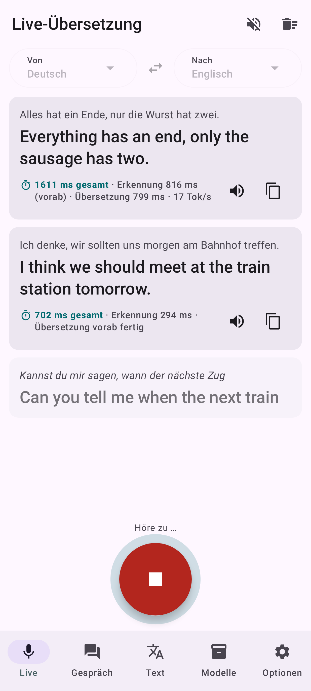
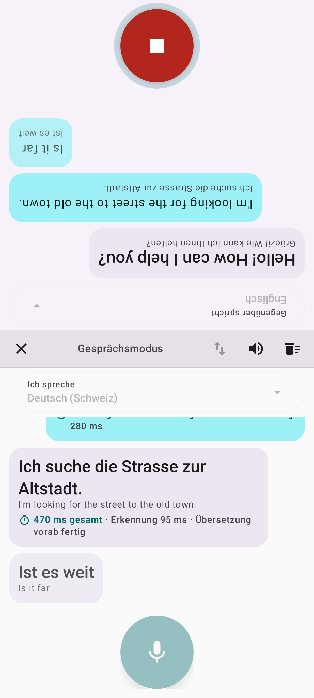
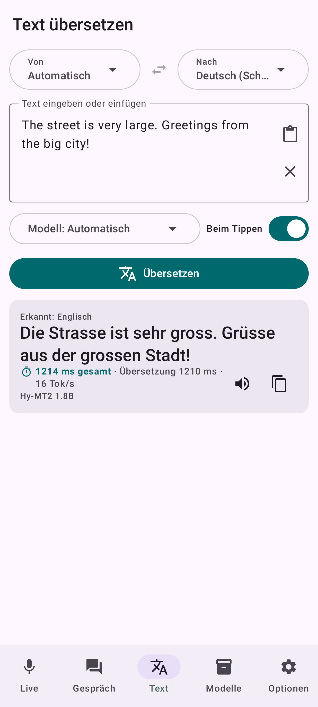
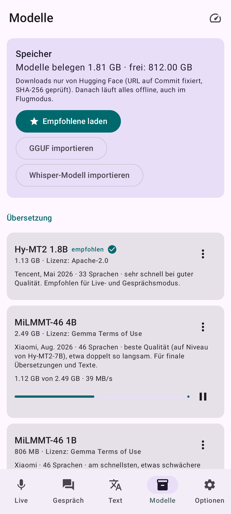
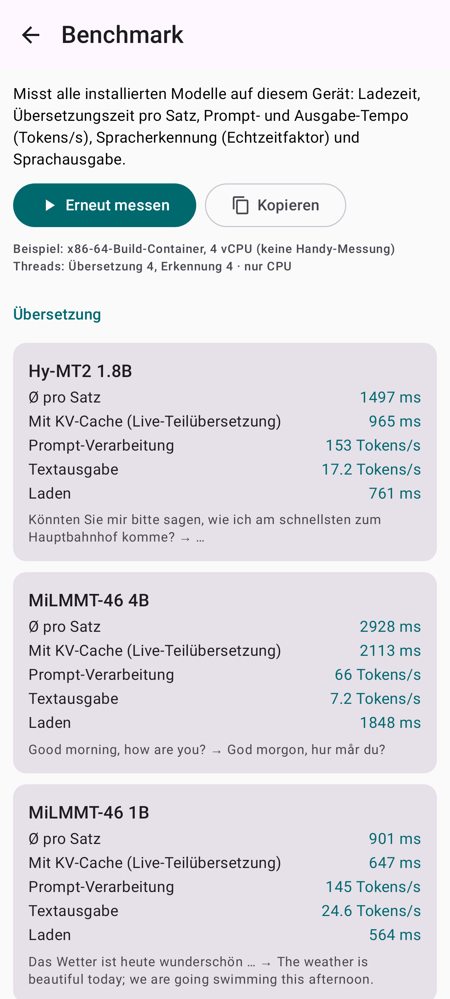

# Fluency – Live-Übersetzer, vollständig offline

Android-App (Kotlin, Jetpack Compose, Material 3) für das **Samsung Galaxy S26 Ultra**
(arm64-v8a, minSdk 31, targetSdk 37). Spracherkennung, Übersetzung und Sprachausgabe laufen
**komplett auf dem Handy**: kein API-Schlüssel, keine Cloud, kein ML Kit, keine Telemetrie.
Das Internet wird nur für den einmaligen Modell-Download gebraucht, danach funktioniert alles im
Flugmodus.

| Live | Gespräch | Text | Modelle | Benchmark |
|---|---|---|---|---|
|  |  |  |  |  |

Die Screenshots sind Robolectric-Renderings (`ScreenshotTest`). Die Texte und Zahlen darin stammen
aus den Integrationstests auf dem x86-Build-Container. Es sind **keine Handy-Messungen**.

## Downloads

- **Fertige App**: [`dist/Fluency-1.2.0.apk`](../dist/Fluency-1.2.0.apk) (arm64, signiert). Sie
  installiert sich als Update über 1.0.0/1.1.0, die heruntergeladenen Modelle bleiben erhalten.
- **Projekt für Android Studio**: [`dist/Fluency-AndroidStudio-1.2.0.zip`](../dist/Fluency-AndroidStudio-1.2.0.zip)
  (enthält alle nativen Quellen und die fertig gebauten NPU-Bibliotheken, keine Submodule)

## In Android Studio bauen

1. ZIP herunterladen und entpacken. Unter Windows einen kurzen Pfad wählen, z. B. `C:\dev\Fluency`
   (der native Build erzeugt tiefe Pfade). Alternativ funktioniert auch GitHubs „Code → Download
   ZIP“ des ganzen Repos; dann den Ordner `fluency` öffnen.
2. Android Studio (aktuelle Version mit Unterstützung für AGP 9.4) → **Open** → Ordner `Fluency`.
3. Gradle-Sync abwarten. Android Studio lädt Gradle 9.8, AGP 9.4.1, Android SDK 37, NDK
   30.0.16248370 und CMake 3.31.6 selbst; eventuell musst du SDK-Lizenzen bestätigen.
4. Handy per USB/WLAN verbinden → **Run ▶**. Der erste Build dauert einige Minuten, weil
   llama.cpp (7 CPU-Varianten, KleidiAI, OpenCL) und whisper.cpp aus dem Quellcode gebaut werden.
5. **Empfohlen**: `fluency-release.jks` ablegen und `keystore.properties.example` als
   `keystore.properties` kopieren und ausfüllen. Dann werden Debug- *und* Release-Builds mit deinem
   Schlüssel signiert, und „Run“ aktualisiert die installierte App, ohne dass die heruntergeladenen
   Modelle verloren gehen. Ohne diese Datei wird mit dem Debug-Schlüssel signiert; dann muss eine
   vorher installierte Release-Version zuerst deinstalliert werden.
6. Release-APK: *Build → Generate Signed App Bundle or APK* oder `./gradlew assembleRelease`
   → `app/build/outputs/apk/release/`.

Python wird nicht gebraucht. Die GPU-Kernel bettet ein CMake-Skript ein
(`app/src/main/cpp/cmake/`); es erzeugt dieselben Dateien wie das Python-Skript von llama.cpp.

## Funktionen

1. **Live-Modus**: Du sprichst, Untertitel und Übersetzung wachsen mit. Etwa alle 400 ms gibt es
   ein Teilergebnis. Sobald du eine Sprechpause machst (~160 ms), werden Erkennung und Übersetzung
   sofort gestartet. Wenn der VAD danach das Satzende bestätigt, wird dieses Vorab-Ergebnis
   übernommen, statt neu zu rechnen. Optional wird die Übersetzung satzweise vorgelesen (das
   Mikrofon ist dabei stumm, damit es sich nicht selbst übersetzt).
2. **Gesprächsmodus** für zwei Personen: geteilte Ansicht, die obere Hälfte steht für das
   Gegenüber auf dem Kopf. Jede Seite hat ihren eigenen Mikrofon-Button. Nach 1,8 s Stille wird
   automatisch übergeben.
3. **Text-Übersetzung** (tippen/einfügen): Übersetzung schon beim Tippen mit dem schnellen Modell,
   per Knopf mit dem besten installierten Modell. Lange Texte werden satz- und absatzweise übersetzt.
4. **Modellverwaltung**: Download mit Fortschritt und Geschwindigkeit. Abgebrochene Downloads
   werden per HTTP Range fortgesetzt, auch nach einem App-Neustart. **SHA-256-Prüfung** jeder Datei,
   die Download-URLs sind auf einen Hugging-Face-Commit fixiert. Dazu: Löschen, Speicherbedarf und
   freier Platz, manueller Import (Dateiauswahl) für Katalogmodelle sowie eigene GGUF- und
   whisper.cpp-Modelle.
5. **Latenz pro Übersetzung**: Erkennung, Übersetzung, Gesamt (vom Satzende bis zur fertigen
   Übersetzung), Tokens/s und ob CPU oder GPU gerechnet hat. Ein **Benchmark-Screen** misst alle
   installierten Modelle auf dem Gerät, die Übersetzungsmodelle je auf CPU und GPU: Ladezeit, ms pro
   Satz, Prompt- und Ausgabe-Tokens/s, mit KV-Cache, ASR-Echtzeitfaktor und Piper.
6. **„Deutsch (Schweiz)"** schreibt immer „ss" statt „ß" (Übersetzungen, Untertitel, Vorlesen).
   Die Oberfläche ist Deutsch in Schweizer Schreibweise.
7. **GPU (Adreno) und NPU (Hexagon) für die Übersetzung**: Optionen → Leistung → „Rechenwerk für die
   Übersetzung“.
   - **Automatisch** (Standard): Beim ersten Laden eines Modells übersetzt die App dieselben zwei
     Testsätze auf CPU, GPU und NPU. Das passiert im Hintergrund, während die CPU schon übersetzt,
     und nur in Sprechpausen. Das schnellste Rechenwerk gewinnt. GPU oder NPU werden auch genommen,
     solange sie höchstens 10 % langsamer als die CPU sind; dann bleibt die CPU für die gleichzeitige
     Spracherkennung frei. Liefert GPU oder NPU eine andere Übersetzung als die CPU, gilt sie als
     fehlerhaft und wird nicht genommen.
   - Das Ergebnis gilt pro Modell. Nach einem App- oder Android-Update wird neu gemessen, ebenso mit
     „Neu messen“.
   - **Immer NPU**, **Immer GPU** bzw. **Nur CPU** legen das Rechenwerk fest. Ein Wechsel gilt
     sofort, ohne Neustart.
   - Die Latenzzeile jeder Übersetzung zeigt, wo sie gerechnet wurde („· NPU“, „· GPU“, „· CPU“). Der
     Benchmark misst jedes Modell auf allen dreien.
   - Spracherkennung (ONNX Runtime, whisper.cpp) und Sprachausgabe laufen immer auf der CPU.

Sprachen: 54 Einträge (Deutsch, Deutsch (Schweiz), Englisch, Französisch, Italienisch, Spanisch,
Portugiesisch und alles, was Hy-MT2 und MiLMMT-46 zusätzlich können). Die App wählt automatisch ein
installiertes Modell, das das Sprachpaar beherrscht.

## Modelle

Geprüft auf Hugging Face am 6.10.2026. Es gibt Nachfolger der im Auftrag genannten Modelle:

| Rolle | Modell | Download | Sprachen | Lizenz |
|---|---|---|---|---|
| Übersetzung schnell (Standard, live + final) | **Tencent Hy-MT2-1.8B** Q4_K_M (Mai 2026, Nachfolger von HY-MT1.5) | 1.13 GB | 33 (+ Varianten) | Apache-2.0 |
| Übersetzung Qualität (optional final/Text) | **Xiaomi MiLMMT-46-4B v1.0** Q4_K_M (Aug. 2026, Gemma-3-Basis) | 2.49 GB | 46 | Gemma Terms |
| Übersetzung sehr schnell (optional) | Xiaomi MiLMMT-46-1B v1.0 Q4_K_M | 0.81 GB | 46 | Gemma Terms |
| Spracherkennung live | **NVIDIA Parakeet-TDT-0.6B-v3** int8 (sherpa-onnx) | 0.67 GB | 25 europ., automatische Erkennung | CC-BY-4.0 |
| Spracherkennung Fallback | **Whisper large-v3-turbo** int8 (sherpa-onnx) | 1.04 GB | ~100 | MIT |
| Schweizerdeutsch (Mundart → Hochdeutsch) | Whisper-large-v3-turbo-Finetune von Flurin17, GGML q5_0 (whisper.cpp) | 0.57 GB | gsw → de | CC-BY-NC-4.0 (privat ok) |
| Sprachaktivität | **Silero VAD v5** | 2 MB | – | MIT |
| Sprachausgabe | Android-TTS (nur Offline-Stimmen), optional **Piper** (Thorsten de, Lessac en, Siwis fr, Paola it, Davefx es, Tugão pt) | je 63 MB + 18 MB eSpeak-Daten | 6 | CC0 / CC-BY / … |

Begründung:

- **Hy-MT2-1.8B** löst HY-MT1.5 ab und schneidet laut der Vergleichstabelle im MiLMMT-Paper
  (FLORES+ en→xx: spBLEU 30.97 vs. 24.81) klar besser ab. Mit 1.8 B Parametern ist es schnell
  genug für Teilübersetzungen während des Sprechens.
- **MiLMMT-46-4B v1.0** erreicht in derselben Tabelle das Niveau von Hy-MT2-7B (WMT24++ XCOMET 85.5
  vs. 86.2) und liegt deutlich vor TranslateGemma-4B (76.0). Deshalb ist TranslateGemma nicht im
  Katalog. Es ist etwa halb so schnell wie Hy-MT2-1.8B.
- **Parakeet-v3** ist das schnellste mehrsprachige Modell (auf x86 RTF ≈ 0.1) und erkennt die
  Sprache selbst.
- **Schweizerdeutsch**: Offene Whisper-Finetunes gibt es nur im whisper.cpp-Format (GGML/GGUF),
  nicht für sherpa-onnx. Deshalb ist whisper.cpp mit eingebaut. Es nutzt dieselbe ggml-Basis wie
  llama.cpp. Das Modell ist langsamer als Parakeet (keine laufenden Teilergebnisse, nur eine
  Vorab-Erkennung pro Sprechpause) und wird nur für die Ausgangssprache „Deutsch (Schweiz)"
  verwendet. Der Encoder-Kontext wird an die Länge der Äusserung angepasst (`audio_ctx`). Auf x86
  sinkt die Zeit für 2,8 s Audio damit von 14,5 s auf 3,1 s, bei identischem Ergebnis.
- Die Modelle sind **nicht in der APK**. Beim ersten Start lädt „Empfohlene laden" Hy-MT2, Parakeet
  und Silero VAD (1.8 GB).

Hinweis zu den Low-Bit-Varianten von Hy-MT2 (1.25/2 bit): Sie brauchen einen STQ-Kernel, der nicht
in llama.cpp-master ist. Deshalb sind sie nicht im Katalog.

## Technik

```
Mikrofon (16 kHz) ─▶ Silero VAD ─▶ Utterance-Puffer ─(alle ~400 ms / sofort bei Sprechpause)─▶ Parakeet (Teil)
                                                                    └─▶ Teilübersetzung, „latest wins", Hy-MT2
                └─(Satzende: 0,4 s Stille)─▶ finale Erkennung (oder Vorab-Ergebnis) ─▶ finale Übersetzung
                                                           (oder fertige Teilübersetzung) ─▶ Vorlesen
```

- **llama.cpp** (Kopie in `third_party/`, Stand 6.10.2026), selbst gebaut per NDK r30 für arm64. Es
  gibt sieben CPU-Varianten (`GGML_CPU_ALL_VARIANTS`: armv8.0 … armv9.2 mit dotprod/i8mm/SVE/SME), die
  passende wählt die App zur Laufzeit. Dazu kommen **KleidiAI** und Q4_K/Q6_K-Weight-Repacking für i8mm.
- **GPU**: llama.cpps **OpenCL-Backend mit den Adreno-Kernels** (`libggml-opencl.so`). Es nutzt das
  `libOpenCL.so` des Herstellers (`uses-native-library`). Die Adreno 840 des S26 Ultra gehört zur
  Generation A8X. Für sie rechnet llama.cpp Q4_K/Q6_K-Gewichte (alle drei Katalogmodelle sind
  Q4_K_M) mit eigenen GEMM- und GEMV-Kernels.
  - Ein Modell läuft ganz auf der GPU oder ganz auf der CPU. Ein CPU-Modell bekommt eine leere
    Geräteliste und berührt OpenCL nie.
  - Das Backend wird erst geladen, wenn es gebraucht wird.
  - Die übersetzten GPU-Programme werden im `codeCacheDir` gespeichert (`GGML_OPENCL_KERNEL_CACHE_DIR`).
    Nur der allererste GPU-Start zahlt die Kernel-Übersetzung.
  - **Absturzschutz**: Vor jedem riskanten GPU-Schritt schreibt die App eine Markierung, nämlich vor
    dem Laden des Treibers, dem Laden auf die GPU (dabei werden die Kernels übersetzt) und den ersten
    GPU-Übersetzungen. Stirbt die App in so einem Schritt, findet der nächste Start die Markierung
    und fragt Android nach dem Grund (`ApplicationExitInfo`). Bei einem Absturz bleibt die GPU
    gesperrt, bis man sie in den Optionen wieder zulässt; es gibt also keine Absturzschleife.
    Beendet Android die App nur (Wischen, Speicher, Update), wird der Schritt beim nächsten Mal
    wiederholt.
  - Meldet llama.cpp auf der GPU einen Fehler, wird dieselbe Anfrage auf der CPU beantwortet, und
    das Modell bleibt dort.
- **NPU**: llama.cpps **Hexagon-Backend** (`libggml-hexagon.so`). Es rechnet seit dem llama.cpp-Stand
  vom 26.9.2026 auch Q4_K/Q6_K-Gewichte, also unsere Q4_K_M-Modelle.
  - Auf der NPU läuft ein eigenes Programm, je eines pro Hexagon-Generation: `libggml-htp-v73.so`
    (8 Gen 2), `v75` (8 Gen 3), `v79` (8 Elite) und `v81` (8 Elite Gen 5, S26 Ultra). Das Backend
    fragt die NPU nach ihrer Version und lädt das passende.
  - Die Verbindung läuft über FastRPC: `libcdsprpc.so` des Herstellers (`uses-native-library`), als
    „unsigned PD“, also ohne Root und ohne Qualcomm-Signatur. Die App setzt `ADSP_LIBRARY_PATH` auf
    ihren Bibliotheksordner, damit FastRPC das NPU-Programm findet, und `GGML_HEXAGON_OPPOLL=1`
    (Warten auf Ergebnisse per Polling, weniger Latenz pro Token).
  - Wie bei der GPU: Das Backend wird erst bei Bedarf geladen. Ein Modell läuft ganz auf der NPU.
    Laden, erste Läufe und Test sind über den Absturzschutz abgesichert, und ein Fehler führt
    zurück auf die CPU. Ein Absturz sperrt nur die NPU, nicht die GPU, und umgekehrt.
  - Beide Beschleuniger-Backends melden sich in ggml als „GPU“. Die JNI-Brücke unterscheidet sie
    deshalb am Namen des Backends („OpenCL“ bzw. „HTP“). C++-Ausnahmen der Backends (z. B. wenn ein
    Gerät die NPU-Sitzung verweigert) fängt sie ab.
  - Gebaut wird das Hexagon-Backend mit Qualcomms **Hexagon SDK 6.6** (Hexagon Tools 19.0.07). Weil
    das SDK nicht frei im Netz liegt, liegen die fertigen Bibliotheken in `app/src/main/jniLibs`;
    Android Studio braucht das SDK also nicht. Neu bauen (nach jeder Änderung an llama.cpp nötig,
    weil `libggml-hexagon.so` gegen die `libggml-base.so` der App gelinkt ist):
    `native/fetch-hexagon-sdk.sh` (holt das SDK aus llama.cpps Snapdragon-Toolchain-Image
    `ghcr.io/snapdragon-toolchain/arm64-android:v0.7`, nur die SDK-Schicht, mit Prüfsumme), dann
    `native/build-hexagon.sh`. Woraus die Bibliotheken gebaut wurden, steht in
    `native/HEXAGON_BUILT_FROM`.
- **JNI-Brücke** (`app/src/main/cpp/fluency_jni.cpp`): Das Modell bleibt warm im Speicher. Der
  **KV-Cache wird wiederverwendet**, es wird nur der Prompt-Teil neu berechnet, der sich geändert
  hat (bei wachsenden Teilsätzen kommen z. B. 31 von 41 Tokens aus dem Cache). Tokens werden
  gestreamt (nur vollständige UTF-8-Zeichen), Abbruch geht jederzeit. Die Prompts sind die kürzesten
  offiziellen Formate (Hy-MT2-Chat-Template bzw. MiLMMT-Completion), Decoding greedy.
- **sherpa-onnx 1.13.8** (VAD, ASR, Piper) aus dem Quellcode gebaut gegen ONNX Runtime 1.28.0 (aus
  Maven), siehe `native/build-sherpa-onnx.sh`. Die gebaute `libsherpa-onnx-jni.so` liegt in
  `app/src/main/jniLibs`.
- **whisper.cpp 1.9.5** für Schweizerdeutsch, statisch in `libfluency_jni.so`.
- Native Libraries werden bei der Installation entpackt (`useLegacyPackaging = true`). Das ist nötig,
  weil die App die passende `libggml-cpu-*.so`, die Backends und die NPU-Programme im
  Bibliotheksordner sucht und lädt. Alle ARM-Bibliotheken sind 16-KB-ausgerichtet; die
  NPU-Programme (Hexagon-Code) packt Gradle unverändert ein. Release mit R8 (JNI-Klassen bleiben
  erhalten) und Signatur v3.

## Bauen (Kommandozeile)

Voraussetzungen: JDK 21, Android SDK (Platform 37, Build-Tools 37.0.0, NDK 30.0.16248370, CMake
3.31.6).

```bash
git clone https://github.com/MADTreasures/playground && cd playground/fluency
echo "sdk.dir=/pfad/zum/android-sdk" > local.properties
./gradlew :app:assembleDebug                 # oder assembleRelease (siehe Signieren)
```

Die nativen Abhängigkeiten liegen als Kopie in `third_party/`, gekürzt auf das, was der Build
braucht. Herkunft und Commit stehen jeweils in `VENDORED_FROM`. Aktualisieren:
`tools/vendor-third-party.sh` (Commits im Skript anpassen). Das Android-Studio-ZIP erzeugt
`tools/make-studio-zip.sh`.

`libsherpa-onnx-jni.so` neu bauen (optional, nur bei einem Versionswechsel):
`native/build-sherpa-onnx.sh android`. Die Abhängigkeiten werden in diesem Skript beschrieben; die
GitHub-Release-Downloads werden dabei nicht benötigt.

**Signieren**: `keystore.properties` im Projektordner (nicht im Repo, Vorlage
`keystore.properties.example`) mit

```
storeFile=/pfad/fluency-release.jks
storePassword=…
keyAlias=fluency
keyPassword=…
```

oder per Umgebungsvariablen `FLUENCY_KEYSTORE`, `FLUENCY_KEYSTORE_PASSWORD`, `FLUENCY_KEY_ALIAS`,
`FLUENCY_KEY_PASSWORD`. Updates müssen mit **demselben Schlüssel** signiert werden (Zertifikat
SHA-256 `81:05:E7:DE:…:9C:6A`), sonst verweigert Android die Installation über die alte Version.

Modellkatalog aktualisieren (neue Commits/Hashes von Hugging Face): `python3 -I tools/gen_model_files.py`.

## Tests

```bash
./native/build-host-jni.sh                   # llama.cpp + whisper.cpp JNI für x86-64
./native/build-sherpa-onnx.sh host           # sherpa-onnx JNI für x86-64
FLUENCY_MODEL_DIR=/pfad/zu/modellen ./gradlew :app:testDebugUnitTest
```

Ohne diese Bibliotheken bzw. Modelle werden die Integrationstests übersprungen; die übrigen
Tests laufen immer. Erwartete Ordnerstruktur (Standard: `test-models/` im Projekt):
`llm/` (die drei GGUF-Dateien), `parakeet-v3/` (encoder/decoder/joiner.int8.onnx, tokens.txt,
test_wavs/), `whisper-turbo/`, `swiss-whisper/ggml-model-q5_0.bin`, `vad/silero_vad_v5.onnx`.

103 Tests in 20 Klassen, alle grün:

- **Logik**: Schweizer Schreibweise, Satz-Segmentierung, Spracherkennung per Stoppwörtern/Schrift,
  Prompt-Formate, Modell-Routing, Katalog (gepinnte URLs, SHA-256), **Downloader** (Fortsetzen nach
  Verbindungsabbruch, `.part` aus früherem Lauf, Server ignoriert Range, falscher Hash), WAV,
  **Live-Pipeline** mit Fakes (Teil- und Endergebnisse, Reihenfolge, Vorlesen, Auto-Stopp).
- **CPU/GPU/NPU-Wahl** mit simulierten Modellen auf CPU, GPU und NPU. Im Container gibt es weder
  eine Adreno-GPU noch eine Hexagon-NPU. Getestet wird dieselbe Engine-Logik wie auf dem Handy:
  - Das schnellste Rechenwerk übernimmt ohne Pause. Sind GPU und NPU langsamer, bleibt es bei der
    CPU. Eine NPU mit falscher Ausgabe schlägt eine korrekte GPU nicht.
  - Die Messung wartet, solange übersetzt wird.
  - Eine gespeicherte Entscheidung lädt das Modell direkt dort.
  - „Nur CPU“ berührt GPU und NPU nie.
  - Ein NPU-Fehler beantwortet dieselbe Anfrage auf der CPU; ein fehlgeschlagenes NPU-Laden wird
    genau einmal versucht.
  - Eine gesperrte NPU bleibt aus, bis man sie wieder zulässt; die GPU bleibt davon unberührt.
  - Ein Wechsel der Einstellung (CPU → NPU → GPU → CPU) wirkt ohne Neustart.
  - Der Benchmark kann jedes Rechenwerk erzwingen.
  - Dazu die Absturz-Markierung je Rechenwerk, das Speichern der Entscheidungen (inkl. Zurücksetzen
    nach einem Update) und Auswahlregel und Textvergleich.
- **Echte Modelle auf dem x86-Container über dieselbe JNI wie in der App**:
  - Hy-MT2: Streaming, KV-Cache-Wiederverwendung, Abbruch, CJK-Ausgabe.
  - Alle sechs Kernsprachen, Auto-Quelle, Absätze, Schweizer „ss":
    „Die Strasse ist sehr gross. Grüsse aus der grossen Stadt!"
  - MiLMMT 1B/4B, inkl. Schwedisch.
  - Parakeet (de/en/fr/es) und Whisper-turbo (inkl. Spracherkennung).
  - Silero VAD mit absoluten Segmentpositionen.
  - Schweizerdeutsch-Whisper über whisper.cpp.
  - Echter Download von Hugging Face inkl. SHA-256 (Silero, 355 eSpeak-Dateien, Piper).
  - Piper spricht, Parakeet erkennt: „Guten Morgen, wie komme ich zum Bahnhof?"
  - **Live-Pipeline Ende-zu-Ende** (Audio → VAD → Parakeet → Hy-MT2) und der App-Benchmark
    (prüft u. a., dass ein wiederholter Prompt bis auf das letzte Token aus dem KV-Cache kommt).
  - Die echte JNI meldet auf x86 „kein GPU-Backend“ und „kein NPU-Backend“; der Automatikmodus
    bleibt dann auf der CPU.
- **Robolectric-Screenshots** aller Bildschirme (`docs/screenshots`).

Messwerte auf dem Container (4 vCPU x86, nur Korrektheitsreferenz, das Handy ist schneller):
Hy-MT2 17 Tok/s, MiLMMT-1B 23 Tok/s, MiLMMT-4B 7 Tok/s, Parakeet RTF 0.12. Live-Pipeline vom
Satzende bis zur fertigen Übersetzung: 1.6 s.

## Messwerte auf dem Handy

Benchmark der App 1.2.0 auf einem Galaxy Z Fold (SM-F976B) mit Snapdragon 8 Elite Gen 5 (SM8850,
derselbe Chip wie im S26 Ultra), Android 17, 6 Threads, 7.10.2026. Die App wählt die CPU-Variante
`armv9.2_2` (SVE2/SME).

Hy-MT2 1.8B (Q4_K_M):

| | CPU | GPU (Adreno) | NPU (Hexagon v81) |
|---|---|---|---|
| Ø pro Satz | 709 ms | 767 ms | **555 ms** |
| Prompt einlesen | 215 Tok/s | 326 Tok/s | **936 Tok/s** |
| Ausgabe | **41.8 Tok/s** | 33.1 Tok/s | 41.1 Tok/s |
| Wiederholung mit KV-Cache (Live-Teilübersetzung) | **406 ms** | 536 ms | 420 ms |
| Laden | **762 ms** | 3011 ms | 2444 ms |

- Die Automatik nimmt die NPU. Sie liest 4,4× schneller ein als die CPU und ist bei ganzen Sätzen
  22 % schneller. Beim Schreiben sind CPU und NPU gleich schnell, begrenzt durch die
  Speicherbandbreite.
- Bei Live-Teilübersetzungen liegt der Prompt grösstenteils im KV-Cache, deshalb sind CPU und NPU
  dort praktisch gleich schnell. Mit der NPU bleibt die CPU für die Spracherkennung frei.
- Die GPU schreibt langsamer und wird nicht genommen.
- Damit ist bestätigt: Die NPU-Sitzung (FastRPC, unsigned PD, ohne Root) läuft in der App, das
  NPU-Programm v81 lädt, und die Ausgabe stimmt mit der CPU überein.

Parakeet-TDT 0.6B v3: 365 ms für 6,6 s Audio (Echtzeitfaktor 0,055).

## Was nur auf dem Handy getestet werden kann

- Mikrofon-Aufnahme, Echo/Rückkopplung beim Vorlesen, Android-TTS-Offline-Stimmen.
- Foreground-Service-Downloads im Hintergrund, Benachrichtigungen, SAF-Dateiimport.
- Schweizerdeutsch-Qualität mit echter Mundart (getestet wurde nur Hochdeutsch-Audio) und dessen
  Tempo auf dem Handy.
- Speicherverbrauch und Wärmeentwicklung bei langen Sitzungen.

## Lizenzen

App-Code: privat. Komponenten: llama.cpp, whisper.cpp und ggml (MIT), sherpa-onnx (Apache-2.0),
ONNX Runtime (MIT), KleidiAI (Apache-2.0), OpenCL-Headers/ICD-Loader (Apache-2.0), eSpeak-NG-Daten
(GPL-3.0). Die NPU-Bibliotheken sind aus dem llama.cpp-Quellcode (MIT) mit Qualcomms Hexagon SDK
gebaut (Qualcomm-Lizenz, private Nutzung). Modelle: siehe Tabelle oben. Sie werden nicht mitgeliefert, sondern vom Nutzer
heruntergeladen. Einige sind nur für die nicht-kommerzielle Nutzung freigegeben.
